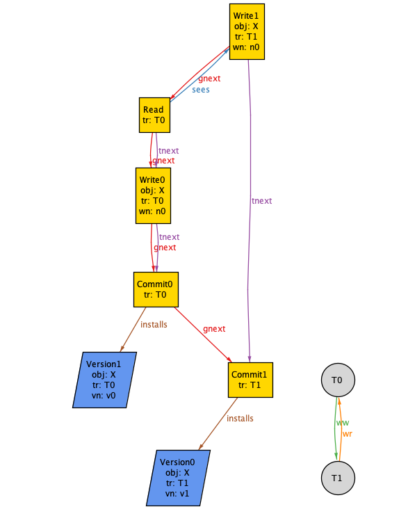

# Modeling transaction histories in Alloy

This repo contains Alloy models for generating database transaction histories, and checking
isolation properties of those histories.

The models in this repo are based on the formal models from the following papers.

### A Critique of ANSI SQL Isolation Levels
Hal Berenson, Phil Bernstein, Jim Gray, Jim Melton, Elizabeth O'Neil, Patrick O'Neil, Microsoft Research Technical Report MSR-TR-95-51, June 1995.
[pdf](https://www.microsoft.com/en-us/research/wp-content/uploads/2016/02/tr-95-51.pdf)

### Generalized Isolation Level Definitions
Atul Adya, Barbara Liskov, Patrick O'Neil. Proceedings of the IEEE International Conference on Data Engineering, March 2000. [pdf](http://pmg.csail.mit.edu/papers/icde00.pdf)
